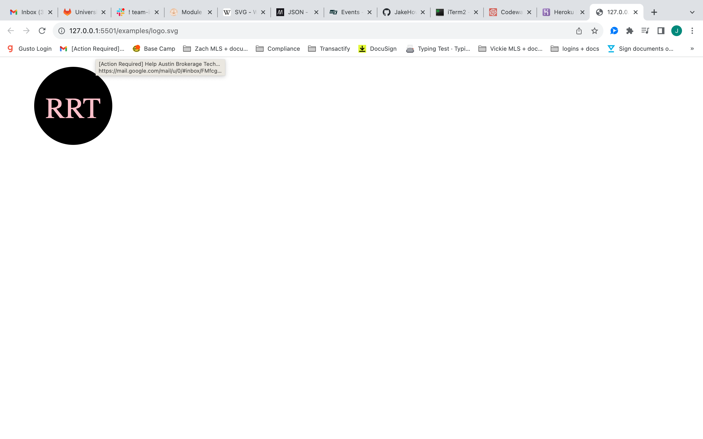

# SVG Logo Generator

## Description

AS a freelance web developer
I WANT to generate a simple logo for my projects
SO THAT I don't have to pay a graphic designer

GIVEN a command-line application that accepts user input
WHEN I am prompted for text
THEN I can enter up to three characters (limited to three?)

WHEN I am prompted for the text color
THEN I can enter a color keyword (OR a hexadecimal number)

WHEN I am prompted for a shape
THEN I am presented with a list of shapes to choose from: circle, triangle, and square

WHEN I am prompted for the shape's color
THEN I can enter a color keyword (OR a hexadecimal number)

These criteria were handled through the creation of an array of prompt objects some of which had a validate requirement making sure that the user input provided met the desired specifications.

WHEN I have entered input for all the prompts
THEN an SVG file is created named `logo.svg`
AND the output text "Generated logo.svg" is printed in the command line

This was achieved by using fs.writeFile based off the user input data and shape classes.

WHEN I open the `logo.svg` file in a browser
THEN I am shown a 300x200 pixel image that matches the criteria I entered

## Table of Contents

- [Installation](#installation)

- [Usage](#usage)

- [Questions](#questions)

## Installation

- Step 1: The user will need to have [Node.js](https://nodejs.org/en/download) installed on their PC or use the link provided to install it.

- Step 2: Before running the program the user will need to install the inquirer package 8.2.4 by typing 'npm install inquirer@8.2.4' into the terminal integrated to the location of the folder holding the program.

- Step 3: in order to test the programs output the user will need to install the jest package by typing 'npm install jest' and making sure that within the 'scripts' object in the 'package.json' file '"test": "jest"' has been added allowing the user to run the tests by typing 'npm run test'

- Step 4: The user will run the program by following the example provided in the [Usage](#usage) section.

## Usage

After running "node index.js" on the command line the user is promted with a series of questions that require them to provide an input or select from a list of items to generate an SVG image that can be used for a logo.

Video Example: https://watch.screencastify.com/v/JpaFJkZ2FMWb6MjmqWk0

## Questions

Regarding any questions please check out my Github profile [JakeHowdeshell](https://github.com/JakeHowdeshell/node.js-readme-generator/tree/main).

Or send me an [email](mailto:Jakehowdy@gmail.com).
